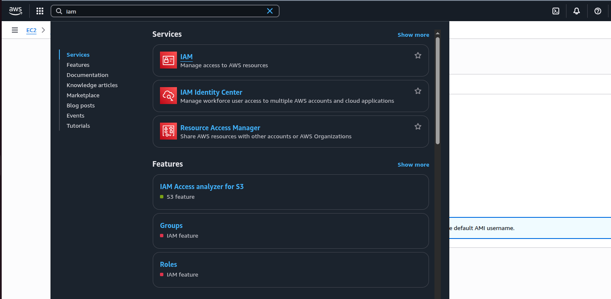
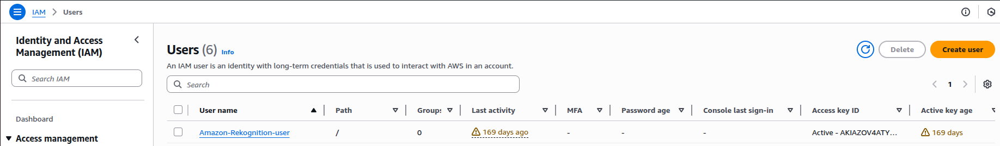
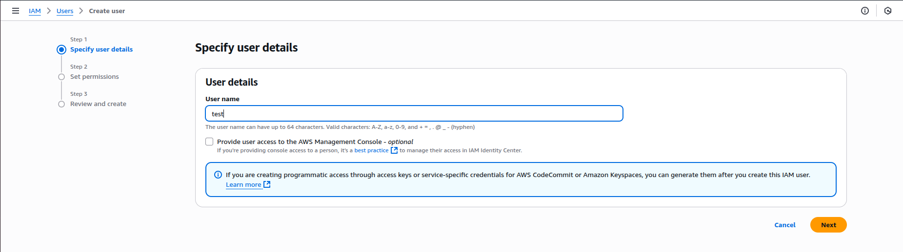
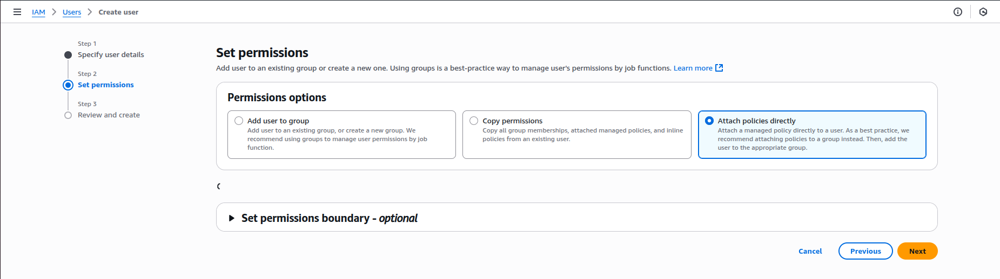
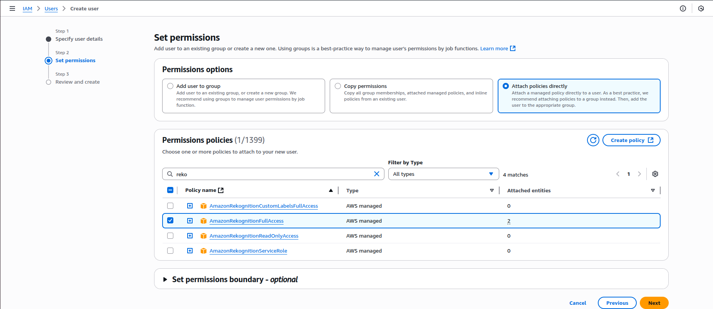
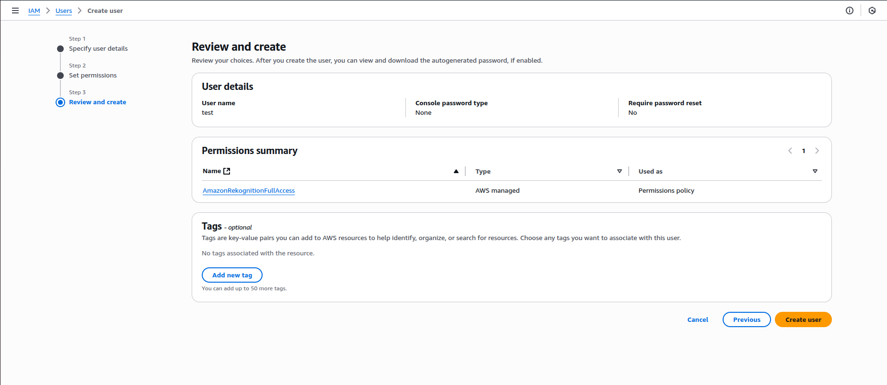
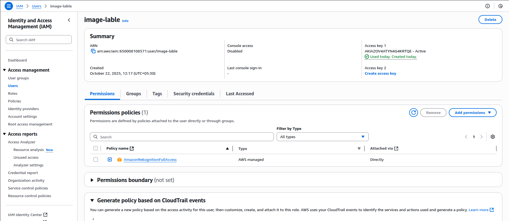

# 🧠 Image Labeling with AWS Rekognition

This project uses **Amazon Rekognition** to detect and label objects in uploaded images.

---

## 🚀 Setup Instructions

### **1. Create an AWS Account**
1. Go to [https://aws.amazon.com](https://aws.amazon.com) and sign in or create a new account.
2. In the AWS Console, search for **IAM** (Identity and Access Management).



---

### **2. Create a New IAM User**
1. In the IAM dashboard, go to **Users → Create user**.  
2. Enter a username (for example, `rekognition-user`).




---

### **3. Attach Rekognition Policy**
1. Choose **Attach policies directly**.
2. Search for and select **AmazonRekognitionFullAccess**.
3. Click **Next**, then **Create user**.





---

### **4. Generate Access Keys**
1. After creating the user, go to **Security credentials → Create access key**.
2. Download the CSV file containing your **Access Key ID** and **Secret Access Key**.
3. **Keep this file private** — never upload it to GitHub or share it publicly.



---

### **5. Create the `.env` File**

In your `backend` folder, create a `.env` file with the following content:

```bash
AWS_ACCESS_KEY_ID=your-access-key-id
AWS_SECRET_ACCESS_KEY=your-secret-access-key
AWS_REGION=your-region  # e.g., us-east-1

